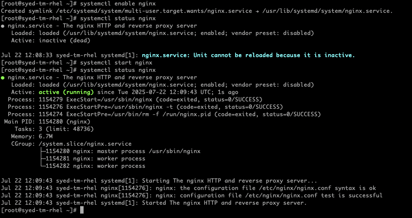
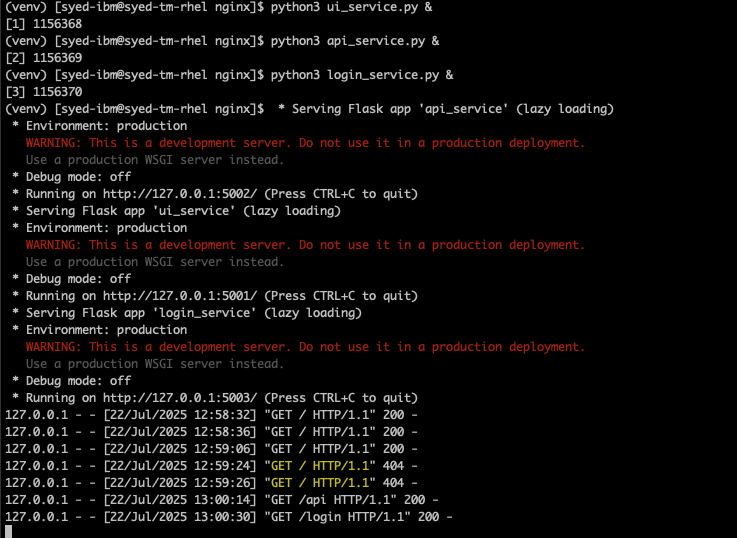
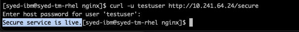
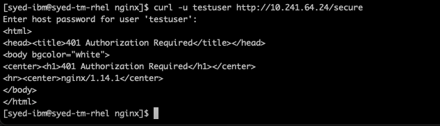
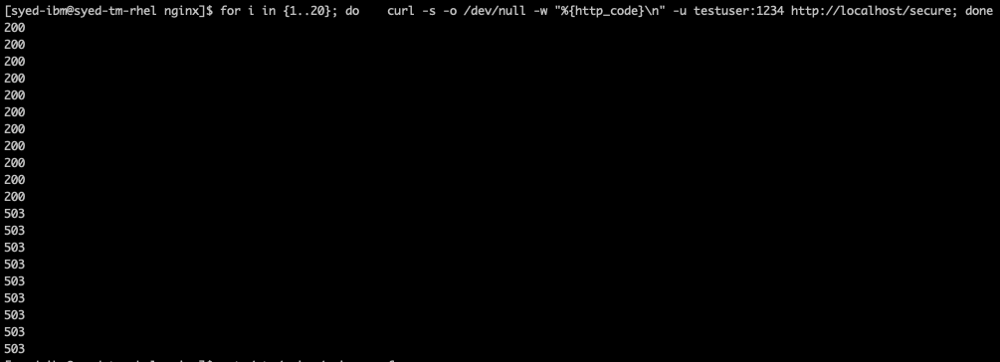
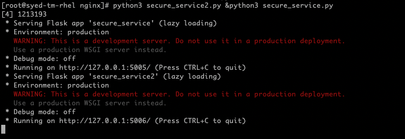
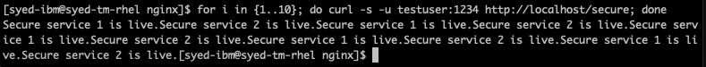

# NGINX POC for Uptycs Architecture - SRE Transition

## Objective

Demonstrate NGINX use cases simulating the role of an edge reverse proxy in Uptycs Cloud environment. This includes support for HTTP/S routing, load balancing, basic authentication, caching, and rate limiting.

---

## Purpose in Architecture

In the Uptycs architecture, NGINX nodes are deployed outside the Kubernetes cluster on virtual machines. They handle incoming traffic and route requests to internal services such as:

- Agent ingestion
- UI dashboards
- API endpoints

---

## Setup Overview

### Step 1: Install NGINX

Install and enable NGINX as a systemd service on a Linux VM

```bash
sudo apt install nginx -y
sudo systemctl enable nginx
sudo systemctl start nginx
```



Check configuration syntax before applying changes:

```bash
sudo nginx -t
```
Enable port forwarding to check frontend 

```
ssh -L 8080:localhost:80 syed-ibm@10.241.64.24
```


---

### Step 2: Create Mock Backend Services

Simulate backend services using Flask:

| Service  | URL Path | Port  |
|----------|----------|-------|
| UI       | `/ui`    | 5001  |
| API      | `/api`   | 5002  |
| Login    | `/login` | 5003  |
| Secure   | `/secure`| 5005, 5006 |

ui_service.py
```python
from flask import Flask
app = Flask(__name__)

@app.route('/')
def index():
    return "<h1>NGINX is proxying to UI Service!</h1>"

if __name__ == '__main__':
    app.run(port=5001)
```

api_service.py
```python
from flask import Flask, jsonify
app = Flask(__name__)

@app.route('/api')
def api():
    return jsonify({"message": "API Service Active"})

if __name__ == '__main__':
    app.run(port=5002)
```
login_service.py
```python
from flask import Flask
app = Flask(__name__)

@app.route('/login')
def login():
    return "Login service is live."

if __name__ == '__main__':
    app.run(port=5003)
```
secure_service.py
```python
from flask import Flask, make_response
import time

app = Flask(__name__)

@app.route('/secure')
def secure():
    response = make_response(f"Secure service 1 - {time.time()}")
    response.headers["Cache-Control"] = "public, max-age=30"
    return response

if __name__ == '__main__':
    app.run(port=5005)
```
secure_service2.py
```python
from flask import Flask, make_response
import time

app = Flask(__name__)

@app.route('/secure')
def secure():
    response = make_response(f"Secure service 1 - {time.time()}")
    response.headers["Cache-Control"] = "public, max-age=30"
    return response

if __name__ == '__main__':
    app.run(port=5006)
```

Run these scripts with python and check for traffic on another terminal


---

### Step 3: Reverse Proxy Configuration

Update `/etc/nginx/nginx.conf` to include mock services:

```nginx
location /ui {
    proxy_pass http://localhost:5001;
}

location /api {
    proxy_pass http://localhost:5002;
}

location /login {
    proxy_pass http://localhost:5003;
}
```

Validate with `curl http://localhost/ui`, `/api`, and `/login`.

UI service


API service


Login service


---

### Step 4: Add Basic Auth to `/secure`

1. Install `htpasswd` utility:
   ```bash
   sudo yum install httpd-tools -y
   htpasswd -c /etc/nginx/.htpasswd testuser
   ```

2. Secure `/secure` route in NGINX:
   ```nginx
   location /secure {
       auth_basic "Restricted Access";
       auth_basic_user_file /etc/nginx/.htpasswd;
       proxy_pass http://localhost:5005;
   }
   ```

3. Update Flask service:

   ```python
   @app.route('/secure')
   def secure():
       return "Secure service is live."
   ```

5. Test scenarios:
   ```bash
   curl -u testuser http://localhost/secure
   ```
Expected results:



Results if authentication fails (e.g wrong password):



---

### Step 5: Add Rate Limiting

```nginx
limit_req_zone $binary_remote_addr zone=one:10m rate=10r/s;

location /api {
    limit_req zone=one burst=5 nodelay;
    proxy_pass http://localhost:5002;
}
```

Run stress test (limit set to 10. For loop will run 20 back to back calls) :

```bash
for i in {1..20}; do curl -s -o /dev/null -w "%{http_code}
" http://<vm-ip>/api; done
```

Expected: HTTP `200` initially, followed by `503` for rate limited requests.



---

### Step 6: Load Balancing

Start two secure backend services on ports 5005 and 5006:

```nginx
upstream secure_backend {
    server localhost:5005;
    server localhost:5006;
}

location /secure {
    proxy_pass http://secure_backend;
}
```


Verify round-robin behavior using `curl` loop.

```bash
for i in {1..10}; do curl -u testuser:1234 http://localhost/secure; echo; done
```



---

### Step 7: Caching

1. Add headers in Flask in secure_service.py

```python
@app.route('/secure')
def secure():
    return "Secure service with caching.", 200, {'Cache-Control': 'public, max-age=30'}
```

2. Add caching config in NGINX:

```nginx
proxy_cache_path /tmp/nginx_cache levels=1:2 keys_zone=my_cache:10m max_size=10m;

location /secure {
    proxy_cache my_cache;
    add_header X-Cache-Status $upstream_cache_status;
    proxy_pass http://localhost:5005;
}
```
Test with curl to verify X-Cache-Status (HIT or MISS)


---

## NGINX Logging

NGINX logs are vital for monitoring traffic, troubleshooting errors, and analyzing access patterns.

### Log File Locations

By default, NGINX stores its logs in:

- **Access Logs:**  
  `/var/log/nginx/access.log`  
  Contains details about incoming HTTP requests, including status codes, IP addresses, response times, etc.

- **Error Logs:**  
  `/var/log/nginx/error.log`  
  Logs issues such as misconfigurations, backend failures, or permission errors.

### Log Levels

Error logging can be set to various severity levels:

- `debug`
- `info`
- `notice`
- `warn`
- `error`
- `crit`
- `alert`
- `emerg`

Monitor logs in real-time using:
```bash
   tail -f /var/log/nginx/access.log
   ```
---

## Final Outputs

- `nginx.conf` with full reverse proxy, auth, caching, rate limit, and load balancing
- Screenshots of mock service hits
- Sample `curl` outputs with headers and response codes
- `.htpasswd` file for secure endpoint
- Python files for mock services

---

## Notes
